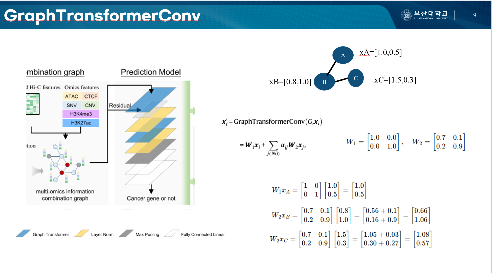

# CGMega Seminar

This repository contains the slides for a research seminar on **CGMega**, a graph neural network-based framework for identifying cancer-related genes.

The seminar was presented at the **Machine Learning & Bioinformatics Lab, Pusan National University (PNU)** in 2025.

  

## Presenter

**Jiwon Lee**  
M.S. Student  
Machine Learning & Bioinformatics Lab  
Pusan National University

## Lab

Machine Learning & Bioinformatics Lab  
Pusan National University  

🔗 https://dmb.pusan.ac.kr/dmb/index.do

## Paper

CGMega: A Graph Neural Network Framework for Identifying Cancer Driver Genes  

## Slides

📄 [View Slides](CGMega.pdf)

## Description

This seminar introduces **CGMega**, a graph neural network-based framework designed to identify cancer-related genes by integrating biological network information and gene features.

The model leverages graph representation learning to capture complex relationships between genes and improve cancer gene prediction.

## Contact

If you find any errors or have questions regarding the material, please feel free to contact:

📧 jiwon_lee@pusan.ac.kr
